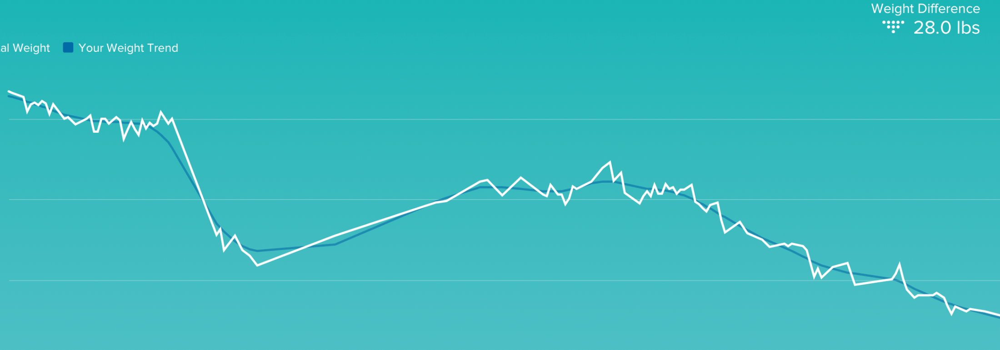

Больше восьми месяцев прошло с того [памятного дня](/blog/2018/02/27/the-leg-chronicles-part-1/), когда я сломал ногу. Воды за это время утекло немало, и какие-то эпизоды, описанные в Хронике, кажутся такими далекими! Больничные завтраки, эпизоды в реабилитационном центре, прогулки на инвалидном кресле по университету, поход на [концерт Pink](https://www.youtube.com/watch?v=i2tfysnMdi0) на костылях, первый раз без костылей на работу… Всё это где-то там, далеко, давно и не со мной :) Впрочем, хватит лирики, перейдём к делу.

Начался октябрь, и у меня официально истекло моё разрешение парковаться на местах для инвалидов. Никакой причины мне там парковаться нет уже довольно давно, и я, наверное, месяца два, если не больше, на таких местах не парковался. В основном потому, что  я уже давно могу пройти любое расстояние, какое пожелаю, и со скоростью, близкой к скорости здорового двуногого. Я всё еще прихрамываю, но если идти не очень быстро, то это почти не заметно . Мне по-прежнему трудновато спускаться по лестнице вниз (или спускаться вниз с холма), зато никаких проблем подниматься вверх, что по лестнице, что просто в горку. По разным причинам, я уже месяц не ходил на физическую терапию, но, справедливости ради, я делаю практически все то же самое, что делают со мной они, только дома. Последняя фишка — приседания без опоры, например :)

Обе ноги сгибаются и разгибаются одинаково хорошо — по этому параметру я на 100% восстановил range of motion в сломанной ноге. Отёк колена сошел полностью месяца два назад, и теперь отчетливо прощупывается титановая штукенция, которую мне туда запендюрили.

Вот эта конструкция на фотографии выпирает немного сильнее, чем обычная кость в том же месте на другой ноге. Я по-прежнему чувствую весь этот титан, когда хожу, но по ощущениям, чувствую я его все меньше и меньше. Вообще, я иногда стал даже забывать, что это неправильная нога, настолько она хорошо работает, и настолько мало стало посторонних ощущений. Несколько раз я прямо ловил себя на том, что “О, я забыл про ногу и шел сейчас как если бы никогда ее не ломал!”. Но если честно, то это скорее обратная ситуация: я совершенно забыл, как ходить не хромая, настолько, что когда вдруг я просто иду себе как нормальный человек, я замечаю это. Это может показаться странным или забавным, но я в самом деле на моторном уровне, как мне кажется, не помню, как ходят не хромая. И постоянно приходится себя одергивать: хромать не нужно, причины нет, ничто не мешает ходить не хромая. Но через 100 метров я об этом забываю, или задумаюсь о чем-то, и потом снова приходится себя одергивать.

Я постепенно приближаюсь к обещанному full recovery — полному восстановлению. Я все еще не могу бегать и прыгать, но подозреваю, что к весне можно будет попробовать и это. Шрам затянулся отлично, особенно если сравнить фотографии до и после. Между этими фотографиями почти ровно 8 месяцев.

Было:

Стало:

Не зря говорят, всё что не убивает нас, делает нас сильнее. Я пересмотрел многое в своей жизни в свете вновь открывшейся её (жизни) хрупкости. Но есть и вполне измеримые изменения: я вешу сейчас почти на 15 килограммов меньше, чем до перелома. В первый месяц после перелома я потерял примерно 8 кг мышц, потом набрал обратно примерно 6 кг жира, и с тех пор потерял больше 10 кг (примерно 18 кг жира, и набрал 8 кг мышц). При этом, нужно отметить, что мышцы в сломанной ноге пока восстановлены не полностью, и я по прежнему каждый вечер  чувствую как будто весь день занимался этой ногой на тренажере — мышцы болят, как после хорошей тренировки. То есть, резерв еще огромный, и я хочу до конца года скинуть еще как минимум скинуть 6-8 килограммов жира и заместить их 3-4 килограммами мышц. Еще никогда в жизни я так стремительно не терял лишний вес. Нет худа без добра, короче. 

На этом серию Хроники ноги можно считать более или менее закрытой. Я, наверное, отчитаюсь еще раз в следующем году, и еще раз через год, но по сути — that’s all, folks!