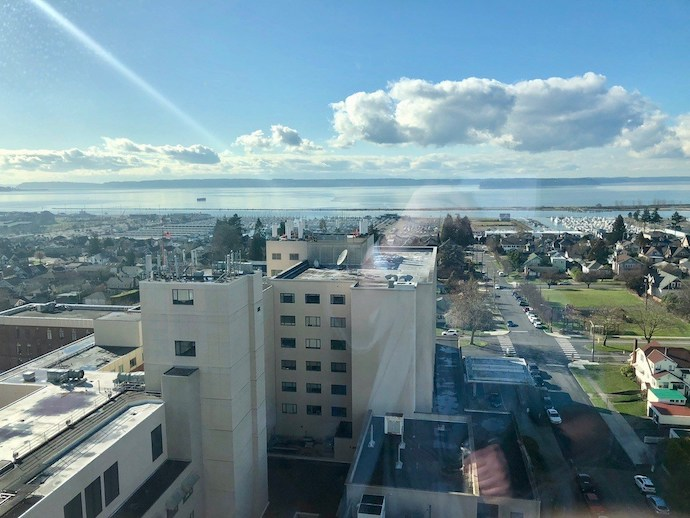
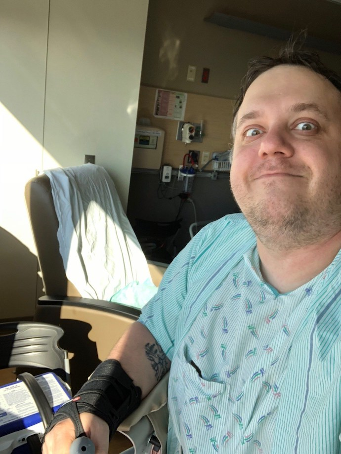
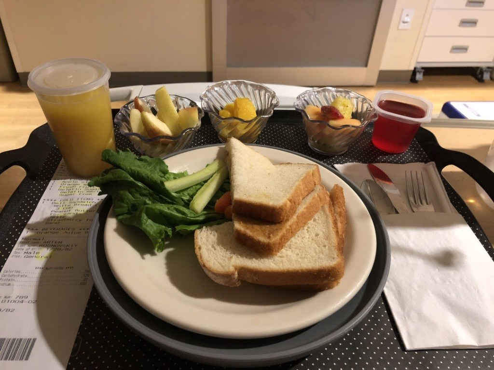
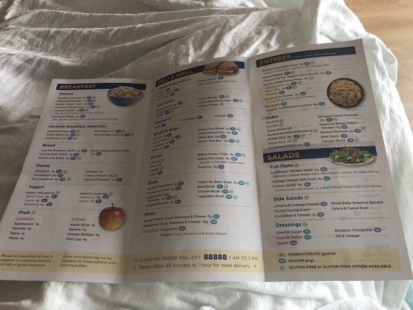
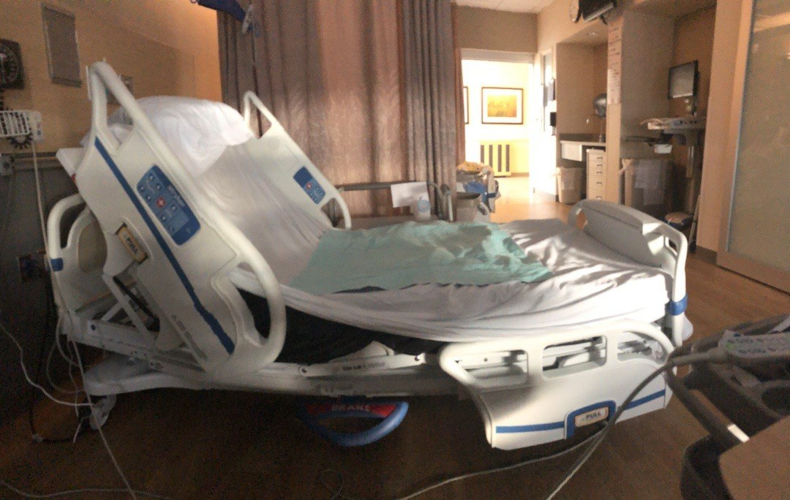
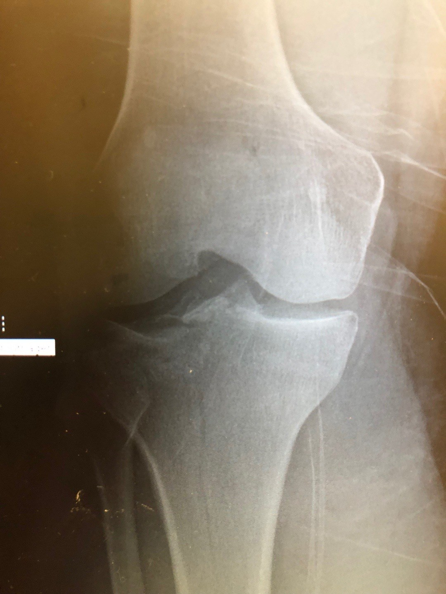
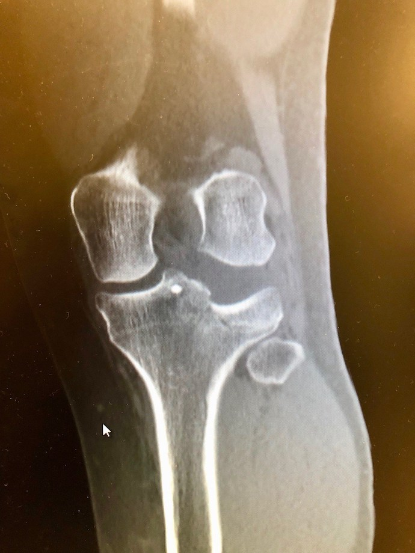
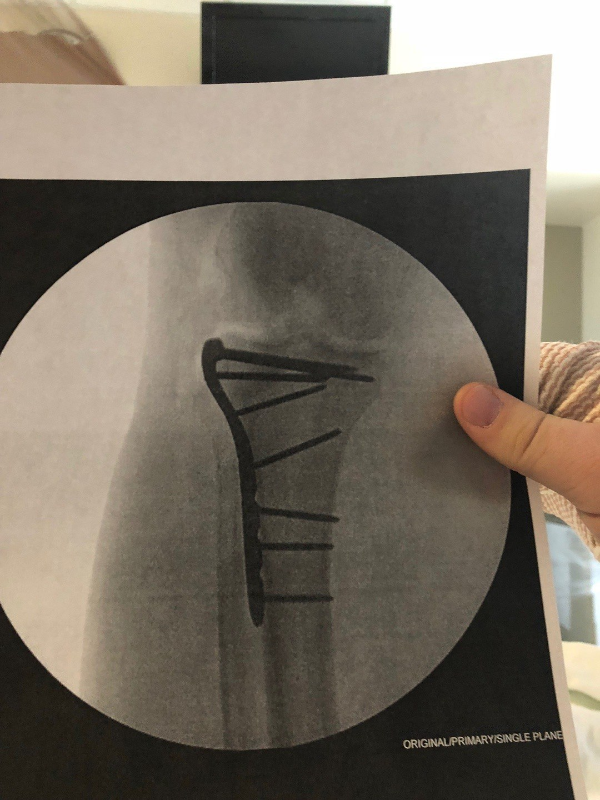

Я не [Alexmak](http://alexmak.net/), это важно отметить сразу. Мне его талант описывать медицинские приключения даже и не снился, но и не приципиться к такой благодатной теме как легендарный [дневник сломанной ноги](https://alexmak.net/blog/2018/03/21/tpf-diary/), я не мог. Поэтому вот. Насколько меня хватит — не знаю, целеустремленность, последовательность и постоянство никогда не были моими сильными сторонами, but then again, сломанное колено никогда не было моим свойством раньше тоже. We’ll see.

Итак, я все еще в госпитале, но дела мои прогрессируют ого-го! В пятницу после операции я ничего не делал, в субботу — тоже фактически ничего, все очень болело, зато в воскресенье!

### Воскресенье

С помощью двух сестер, четвероногого костыля (walker — волкер я буду его называть дальше), и такой-то матери, я встал с кровати и пересел в кресло примерно в 2 метрах. На все ушло около 40 минут в сумме, и под конец с меня ручьем лился пот, я похудел на 300 килограмм, и в кресле почти мгновенно уснул на час. Потом я проделал этот же затяжной кульбит обратно — это был очень длинный день, полный приключений! В этот же день я начал разрабатывать колено на специальной машине CPM (continuous passive motion): ты заряжаешь в нее ногу, выбираешь параметры насколько нужно её сгибать, и машина тебе её сгибает строго в рамках указанных градусов. Я начал с амплитуды между 5 и 30 градусами, и думал, что умру от боли. Сказались, видимо, мои прогулки под луной в кресло и обратно, плюс сестра которая заряжала ногу, явно не член Ногозаряжательной Ассоциации Америки, и заряжала ее без души и огонька. В итоге через два часа этой пытки меня извлекли из девайса, дальше все как в тумане.

### Понедельник

Вооруженный новой информацией о своих способностях и ограничениях, я приступил к новому дню с чистого листа. Начал с прогулки к окну, где сделал фотография вида из окна:

_завидуйте!_

и сэлфи:

_терпите!_

откуда отправился на кресло отдыхать и есть апельсин. С кресла вернулся в кровать, где меня, как капкан, уже поджидала сгибательная машина. В этом раз я объяснил древнюю русскую мудрость которая помогает достигать дзена и имеет некоторое отношение к Ивану Сусанину: если нога не ваша, и сгибать ее машина будет не вам, идите лесом. И выбрал свой темп, отнял у сестры пульт управления, она написала мне грозно на доске результаты которых я должен достичь (от 0 до 30) и ушла не попрощавшись. На самом деле, конечно, все было иначе, и я просто обрисовал картину, что вчера ногу так мотали туда сюда, что еще до погружения на машину, она уже болела хуже пареной репы. И, мол, давайте в этот раз погрузим ее тихонько, угол выберем небольшой, и будут мелкими перебежками двигаться к цели. И, знаете, получилось! Экстримы 0 и 30 градусов, конечно, вызывали более сильную боль, но не так что нельзя терпеть. Таким образом все цели и планы на день были выполнены и перевыполнены.

Больничное меню (звонишь по номеру 88888 и заказываешь в нумера). Я тут перешел на практически полностью вегетарианскую диету, питаюсь в основном фруктами и овощами, и немного балуюсь желе и буетербродами с арахисовым маслом. Я о диете отдельно напишу, меня прям распирает :)

День выдался полный приключений. Ходил к окну и в туалет, даже немного посидел на унитазе, простите за интимную подробность. Безрезультатно, но черт с ним, главное ведь как человек! Прогулялся к окну, сходил на кресло, как ни в чем не бывало прошелся в коридор и обратно. Конечно, нельзя забывать, что когда я говорю сходил, на самом деле рядом и чуть сзади идет сестра, держит меня за специальный страховочный ремень на случай чего (хаха), а я стою внутри волкера, переставляю его на 10 сантиметров вперед, прыгаю на здоровой ноге на эти 10 сантиметров вперед, опираясь всем весом на волкер, и подтягиваю больную ногу. Никакой вес на нее нельзя ставить в течение как минимум 8 недель, свежайший прогноз по состоянию на сегодня. После таких путешествий, я вернулся на кровать, где меня уже мастерски и с прибаутками зарядили в сгибательную машину и поставили на сегодня цель: как минимум от 0° (это больше даже не обсуждается) до 55°. Ну я принялся за дело так, будто будущее пролетарской революции зависит от меня лично, и если я буду отлынивать, к власти придут коммунисты! Короче, через час угол был 0–60, еще час я его, как все полимеры,просгибал. Машина эта, конечно, все соки из тебя выжимает, и вроде и не делаешь особо ничего, а как будто марафон пробежал за 2 часа. Сейчас меня ждет еще одна сессия ногосгибания, потом приедет семья… Жизнь налаживается :))

_моя база_

### Что случилось?

Никто не просыпается утром с мыслью, а не сломать ли мне сегодня колено наиболее болезненным и бессмысленным способом? Все кого вы знаете, кто ломал себе конечности, сделали это не умышленно, не запланировано и совершенно того не желая. (Помните об этом когда будете думать, “ну я-то точно ничего себе не сломаю, я ведь не собираюсь ничего себе ломать” — никто не собирался). В среду мне доставили новый велик, который должен был стать моим главным транспортным средством для езды на работу и с работы на ежедневной основе. В четверг для него доставили новое сидение (seatpost, на самом деле, но это детали). Я его установил и решил найти какой-нибудь бамп на дороге, чтобы его опробовать. На часах было половина третьего примерно, время обеда. Поскольку у нас в этот день был жуткий гололед, я решил что я довезу велосипед руками до какого-нибудь люка или стыка на дороге, и если там нет льда, опробую ситпост. Так вот, вышел я с драйвея, прошел метров 20 по дороге и поскользнулся. Я не понимаю точно, что произошло, но грубо говоря, правая нога ниже колена поехала в сторону правую сторону от колена и ниже, хрустнула или даже скорее щёлкнула в районе колена, после чего я пытаясь устоять на ней, рухнул всем весом на лёд, правым коленом и правым запястьем (оно тоже треснуто, но не это ерунда). Я сразу понял, что нога сломана или очень, очень сильно вывихнута. В надежде на второе, я попытался на нее встать, но не вышло, нога не держит, боль зверская, адреналин качает. Поскольку этого не было в моих планах, телефон мой остался наверху. Спасибо, велосипед с электроприводом, я погрузил половину себя на него и здоровой ногой и электромотором докатился до гаража. 

Дальше я полчаса взбирался по лестнице наверх. Никогда не пробуйте забраться наверх по лестнице, у которой 16 ступеней со сломанным коленом и запястьем. Вы, конечно, сожжете 982,000 калорий, но удовольствия получите очень, очень мало (unless you’re into this kind of thing. Hey, I don’t judge!). Я забрался на второй этаж, взобрался ну стул (мамой клянусь, я не понимаю как! Маме, кстати, привет! :), и пошел искать в интернете, что теперь делать. Первоначальный план был такой: я подозреваю, что у меня может быть сломана нога, возможно — колено. У меня сильный ушиб руки (сам пройдет, не первый раз). Я попробую вызвать Убер и поехать в Urgent Care. Urgent Care — это что-то вроде неолтложки, такая Скорая Для Бедных. Стоит сильно дешевле обычной скорой, но не предоставляет полный спектр услуг. Я позвонил в ближайшую Urgent Care, где мне сказали, что я сумасшедший, и у них нет лицензии лечить сумасшедших, и что я с переломом должен звонить 911. Не так, конечно, но дядьку на том конце несуществующего провода я явно развлек. Ок. С этой новой информацией, первое с чем нужно смириться — потеря денег. Визит в ER по скорой — это минимум 8–10 тысяч долларов. Когда ты смирился с этим(мне понадобилось секунд 10), и понял, что никакой Убер тебя не спустит теперь по лестнице вниз, ты звонишь 911. Рассказываешь свою историю, они просят тебя остаться на линии, все как в кино. Потом через 5 минут (или даже меньше, сложно сказать), приезжают две бригады пожарных, входят в слава Зевсу незапертую дверь, разрезают джинсы на обеих ногах чтобы сравнить отек на целой и подозреваемой ноге, срезают шнурки с кроссовка на поврежденной ноге чтобы снять его, готовят тебе специальное кресло для спуска по лестнице, задают вопросы, все происходит очень быстро, и вот тебя уже спустили вниз, закатили в ambulance и везут в крупнейший медицинский центр твоей каунти и самый загруженный в штате Вашингтон. Пожарные тебя развлекают разговорами, прибаутками, шутками, рассказывают истории, в общем ты с ветерком доезжаешь до Emergency, где тебя прямо из машины закатывают в палату 609, на 1–2–3, как в кино перекладывают на стол и ты лежишь, довольный собой (на самом деле, не очень довольный). Лежишь и ждешь. 

Тебя быстро регистрируют, собирают всякие данные, включая то какие лекарства ты принимаешь, и потом ты ждешь. Сначала ждешь рентгена, просишь заодно посмотреть запястье, которое вместо того чтобы пройти стало болеть сильнее. Тебе делают 30 снимков во всех проекциях и подо всеми углами. Потом ты ждешь пока их посмотрит доктор. И поскольку ты слышишь как по громкой связи объявляют что через 10 минут примерно привезут полную травму, и видишь потом как доктора и сестры носятся, собирая человека по частям (этого ты, конечно, не видишь), доктора ты ждешь терпеливо. Он приходит и сообщает что у тебя все сломано, ты просишь его показать, и он берет твой телефон идет к своему компьютеру, делает тебе несколько фоток — компьютер в палате не показывает эти снимки почему-то. Ты думешь, что доктор шутит и зачем-то показывает тебе посмертный портрет Шалтая Болтая. Но нет, это твое колено.

Доктор назначает CT скан чтобы увидеть масштаб проблемы в высоком разрешении и в 3D. Еще через час тебе говорят, что ты тут заночуешь, потому что утром тебе, возможно, сделают операцию. На часах почти десять вечера. Несколько часов назад ты позвонил жене, у которой сегодня был единственный выходной на неделе, и который она проводила в Сиэтле, и обрадовал новостями. Она едет к тебе и везет попрошенные тобой штаны и кроссовок (хахахахаха. хахахаха, ой не могу) — чтобы после операции поехать в этом домой, конечно (ой, ахахаха, фуф… хахахаха). В итоге, в начале одиннадцатого ночи тебя вкатывают в палату D1004, ставят капельницу, подключают приборы мониторинга важных жизненных функций, приносят ужин (лосось, фрукты), на который ты не в силах даже смотреть, дают первое обезболивающие, а потом приезжает семья и ты им пересказываешь как умеешь свои приключения.

Как я теперь понимаю, операция была мне назначена еще внизу, в Emergency, но почему-то мне продолжали говорить, что это не точно, и специальный хирург скажет утром точно. Специальный хирург утром, разумеется, сказал “резать не дожидаясь перитонита!” — как следствие, еще с полуночи мне было запрещено есть и, что важнее, пить. Операцию в пятницу откладывали несколько раз потому что поступали emergency случаи, которые требовали хирурга-ортопеда. В итоге, на операцию меня покатили днем в начале третьего. Со мной поговорили все, как в кино: анастезиолог (выбрали epidural анестезию, и если не получится, то general), ассистенты рассказали что и как, потом пришел сам сияющий и неотразимый доктор Уоррен, и как звезда рок-н-ролла, практически в стихах описал что меня ждет, mic drop. Все круто, меня везут в операционную, где выясняется, что меня нельзя кантовать. Буквально, они не могут положить меня на бок чтобы сделать эпидуральную анестезию — нога в таком положении и состоянии, что нельзя. Мгновенно переключаются на общую анестезию, просят посчитать до пяти, и где-то на трёх я заснул.

_так теперь выглядит мое правое колено изнутри. Я теперь немного Falcon Heavy!_

Отходить от общей анестезии всегда трудно и мерзко и тяжело, и все от тебя что-то хотят, и задают какие-то непонятные вопросы… А хочется-то просто спать дальше и чтобы все отстали. Но нет. В общем, по первым словам операция прошла успешно (чтобы это ни значило), жене позвонили, она скоро приедет, что-то наверное еще происходило, я очень плохо помню, все в тумане. Накачали обезболивающим и повезли в палату. Как раз к приезду семьи стало ясно, что обезболивающих маловато будет, что одним оксикодоном сыт не будешь, и мне ставят помпу с морфином прямо в IV (в капельницу, то есть, IntraVenous), но помпа специальная: раз в десять минут можно нажать кнопку и она подаст очень маленькую дозу морфина. Чтобы реально почувствовать результат мне понадобилось часа, наверное, три. После чего я благополучно заснул. То ли до, то ли после наступила суббота.

Субботу я помню очень плохо, но как вспомню что-нибудь — расскажу.

Всем кто интересуется что дальше — терпите, отчет завтра. Пока же вот вам цифра года:

> # $71,161.53

Столько пока стоило мое пятидневное пребывание в госпитале. Что и как из этого покроет страховка — покажет время. Буду держать в курсе!

Поддержать автора можно [тут](https://paypal.me/rosnovsky/15), а лучше  — вот [тут](https://patreon.com/podtema). Специальные выпуски подкаста последуют!