Как говорил Карлсон, который живёт на крыше, “продолжаем разговор”. Вот, кстати, [первая часть](/blog/2018/02/27/the-leg-chronicles-part-1/).

Вчера титановой пластине и шурупам в моей ноге исполнилось две недели. Шраму во всю ногу исполнилось столько же. По этому поводу я совершил настоящее путешествие в другой город . Но сначала немного предыстории.

В общей сложности, я провел в госпитале 8 дней. Это намного больше, чем обычно. Обычно, тебя выпихивают как только ты можешь сам доскакать до туалета, что в моем случае произошло на 4-ый день после операции. Теоретически, меня должно были отправить домой, но не тут-то было. Госпиталь не может отправить человека домой, если это небезопасно. Что значит “небезопасно”? Ну, например, чтобы попасть домой, нужно подняться на 2 этажа и 32 ступеньки. Для человека со сломанной ногой и правой кистью (на них нельзя переносить никакой вес) это становится практически непреодолимым препятствием. И госпиталь не может выписать тебя домой, пока вы не придумаете, как это обойти.

Каждый день, на час или на два, к тебе приходят OT и PT: Occupatioanl Therapy и Physical Therapy. Первые отвечают за твою адаптацию к нормальной жизни и за обычные ежедневные задачи вроде переодевания и похода в туалет, а вторые — за более конкретные физические действия типа сгибания ноги, использования костылей и прочего. Так вот, вместе с этими людьми мы пытались придумать какой-то план, который позволил бы мне попасть домой. Рассматривались все варианты, от вызова бригады грузчиков, которые занесут меня на третий этаж (у нас таунхаус, и спальни на третьем этаже), до заползания наверх задом на попе, работая локтями. После нескольких дней тщетных попыток что-то придумать, было решено, что я поеду на 7 недель в реабилитационный центр, где дождусь пока можно будет снова наступать на ногу, и пока я не смогу самостоятельно подняться по лестнице.

Поскольку пишу я вам сейчас из дома, куда я приехал еще 5 дней назад, как можно догадаться, все пошло иначе, и тому есть несколько причин.
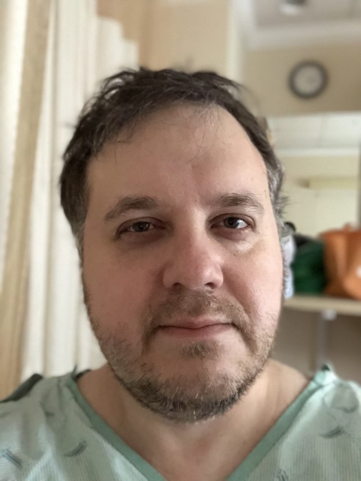

Идея рехаба была хороша в том смысле, что позволял заниматься терапией, тренироваться и восстанавливаться, одновременно удаленно работая на работе. В последний момент, правда, работа решила, что она не хочет чтобы я работал удаленно, и отправила меня в бессрочный неоплачиваемый отпуск, я теперь де-факто безработный. Смысл продолжительного и спокойного восстановления в рехабе как-то резко уменьшился, и я страшно захотел домой. Тем не менее, в прошлую субботу меня таки перевели в реабилитационный центр, где я провел бесконечные 4 дня. Почему не сразу домой? Во-первых, мне нужно было потренироваться где-то подниматься по лестнице на попе. Во-вторых, в воскресенье мы переезжали со старой квартиры в новый таунхаус. Мы должны были переехать за неделю до этого, но события первой части вынудили нас перенести переезд на неделю. Пользуясь случаем, хочу сказать огромное спасибо друзьям, которые с этим переездом помогали! Без вас все было бы намного труднее!

Таким образом, мне оказалось нужно переждать выходные где-то, чтобы не переезжать со сломанной ногой. Пережидал я выходные в Genesis Everett Rehabilitation Center. Это что-то среднее между домом престарелых, хосписом и дуркой. Я не преувеличиваю, это был совершенно чудовищный опыт, повторить который я не пожелаю и врагу. Это настолько мрачное и депрессивное место, что слов у меня нет. Скажу только что сразу после прибытия, в голове у меня крутились слова nurse Ratchet и escape, а также почему-то очень захотелось угнать школьный автобус и поехать в Depoe Bay кататься на лодке. Главный плюс, который я вынес из этого ужасного места — я натренировался забираться вверх по лестнице, и стал абсолютно уверен в своих силах подняться таким образом на два этажа.

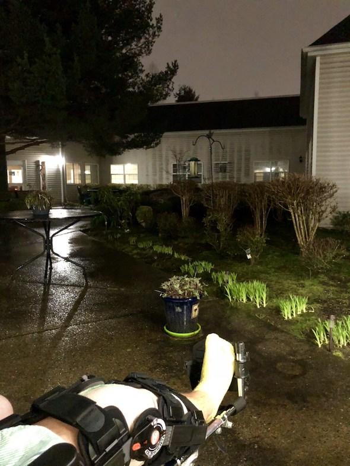
_В рехабе у меня было свое кресло на колёсиках, и я пользовался этим каждый вечер, наворачивая круги по зданию и выезжая во внутренний дворик._

Так прошли выходные, Ленка, грузчики и друзья перевезли наше барахло из квартиры в таунхаус. Утром в понедельник у меня на телефоне были 18 СМС от Ленки: после первого же использования прорвало трубу в душе, и вода залила все два нижних этажа, включая гараж.

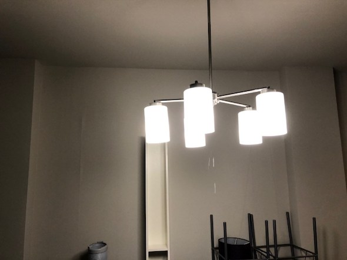

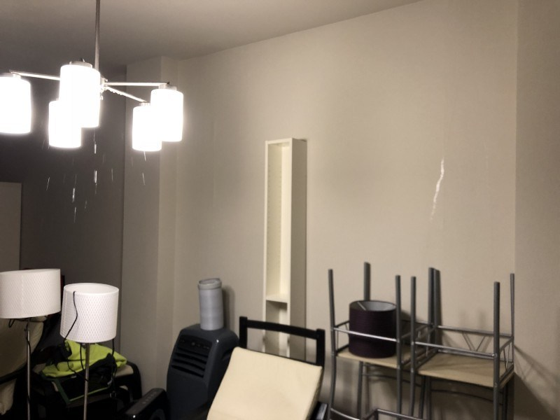

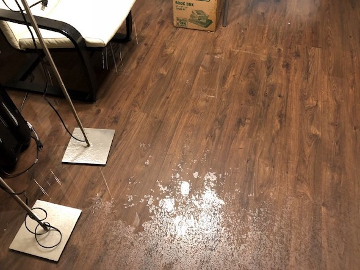

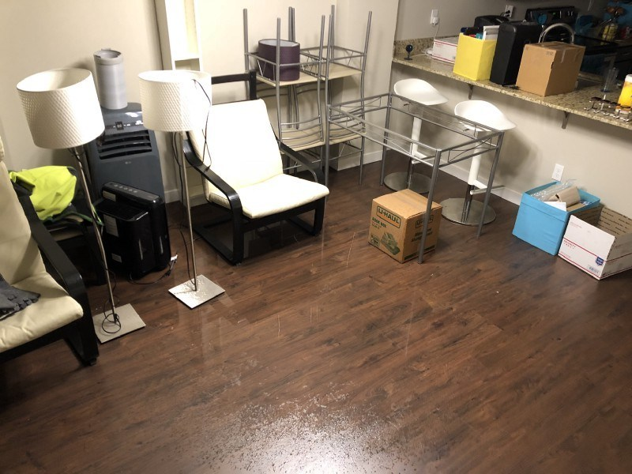

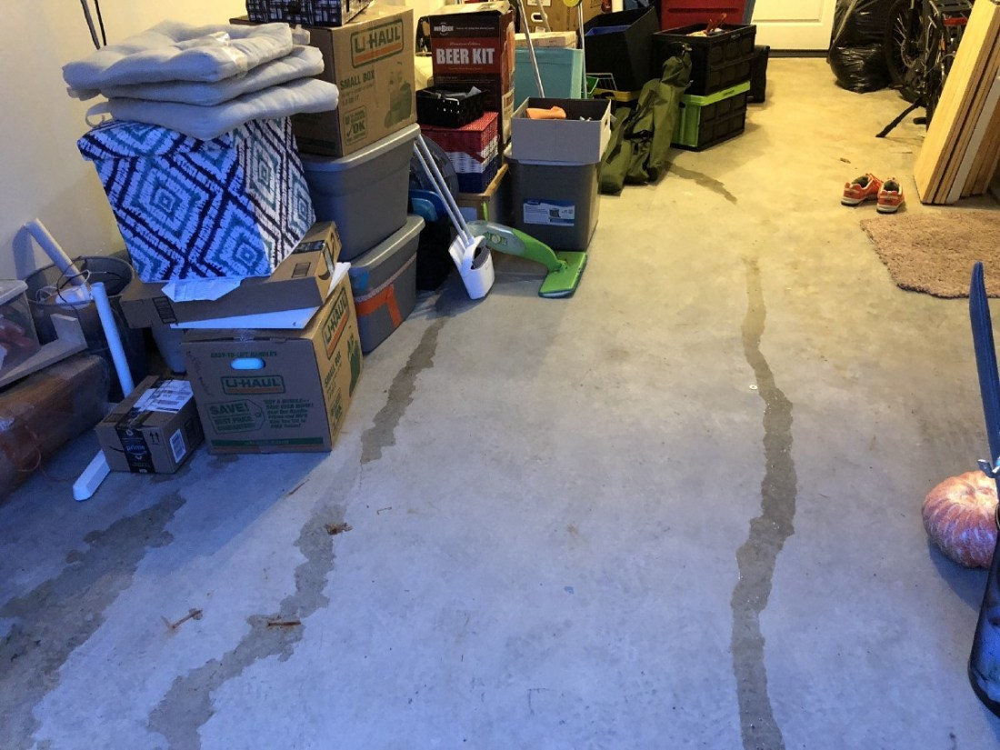

Как я ставил на уши менеджмент компании, у которой мы снимаем этот таунхаус, я расскажу как-нибудт потом. Добавлю лишь, что у нас дома теперь ремонт, и когда он закончится точно не известно.

Anyway, во вторник с огромный облегчением я покинул реабилитационный центр. За мной приехала Ленка, я потренировался садится в машину и выходить из нее практически не используя правую руку и совсем не использую правую ногу, отменил заказанный заранее медицинский транспорт, и мы поехали кататься :) Погода стояла отличная, у Ленки был выходной, и она свозила меня сначала в Dick’s (поесть человеческой еды), а потом в Kerry park, любоваться Сиэтлом и греться на солнышке.

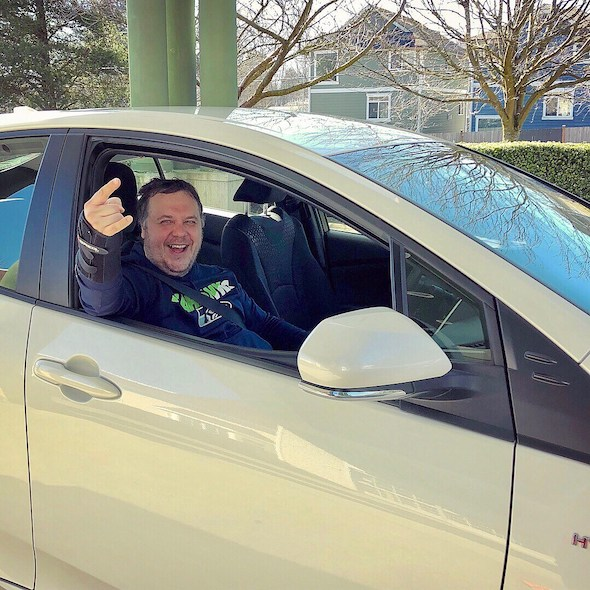

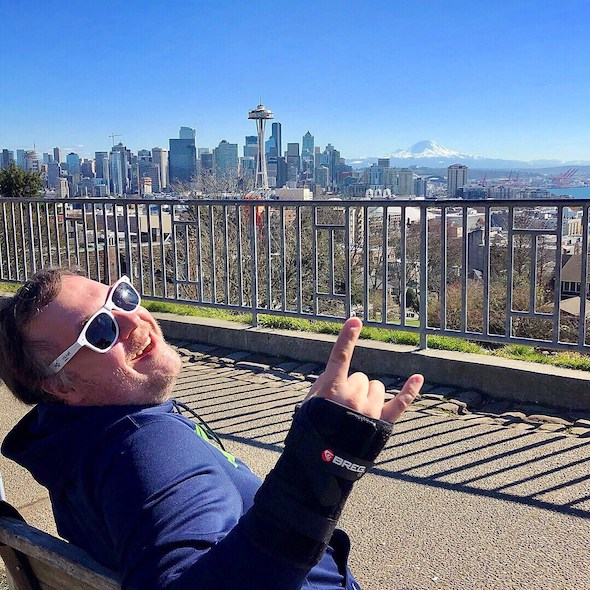

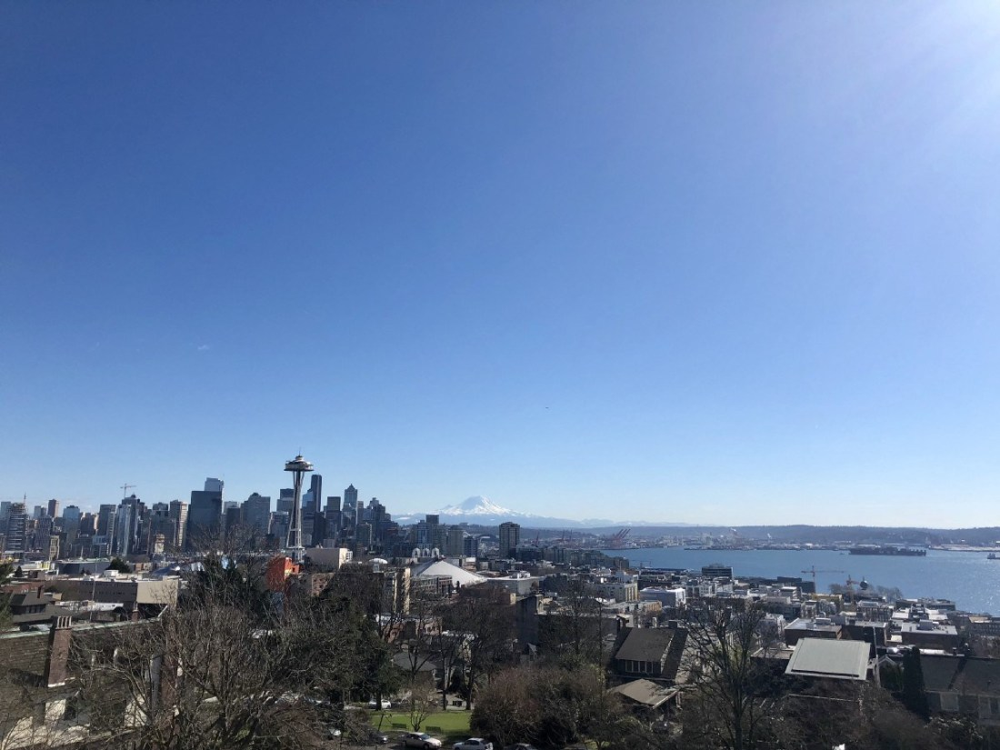

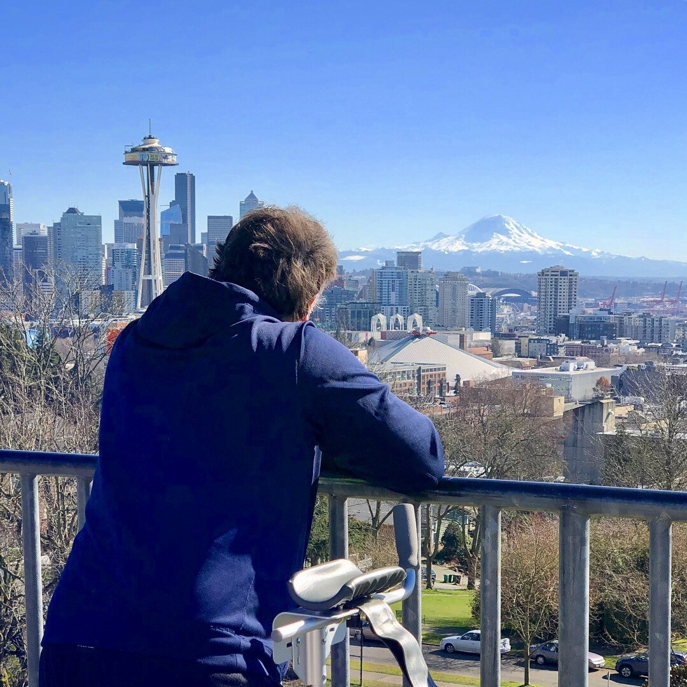

После такого крутого приключения, мы поехали домой, где я успешно забрался на третий этаж в спальню. С тех пор, я сижу в этом самом кресле, время от времени встаю чтобы попрыгать с волкером по коридору или в ванную. Дни мои, мягко говоря, однообразны. Ищу удаленную работу, смотрю тутариалы, доделываю проекты, до которых месяцами не доходили руки.

Так вот, это все однообразие было нарушено в пятницу, когда у меня был назначен послеоперационный follow-up визит к доктору. Доктор находится в городе Everett, если верить Lyft, ровно в 11.5 милях (18.5 км) от дома. Чтобы быть у врача в 9:40, в 9 утра я начал свое первое снисхождение на первый этаж. Все также на попе, с волкером в зубах. Я управился буквально за 15 минут — ползти вниз проще, чем вверх. Спустившись на первый этаж, я вызвал Lyft, который привез меня прямо к дверям клиники, запрыгав в которую я немедленно попросил кресло, на котором и рассекал дальше до самого конца визита.

Визит был посвящен общему осмотру ноги, удалению скрепок, которые держали шрам вместе, рентгенам руки и ноги, и описанию следующих шагов. Удалять скрепки, все 40 штук, заняло 10 минут и было не очень больно, хотя и приятного, мягко говоря мало.

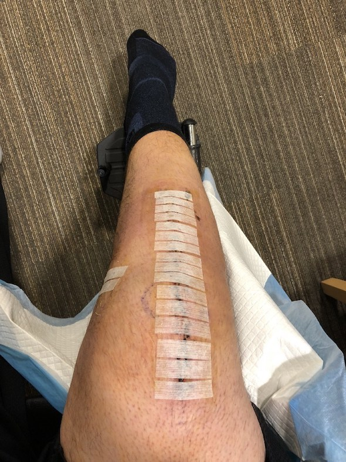
_Шрам без скрепок и заклеенный медицинским скотчем выглядит намного лучше, чем раньше!_

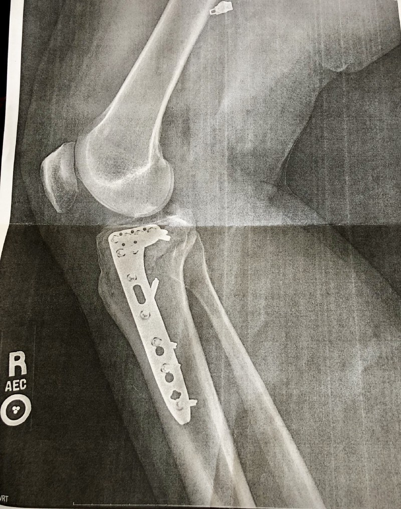

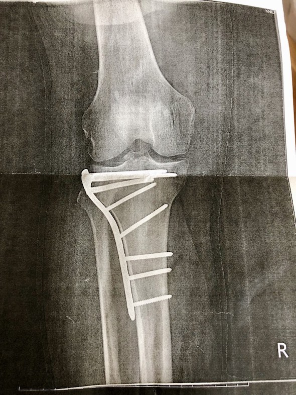

По словам доктора, всё заживает идеально, прямо как по учебнику. Ногу можно мыть уже завтра! Без фанатизма, аккуратненько, но можно мыть! Наступать на ногу нельзя ещё 6 недель, столько же нельзя давать полный вес и на правую кисть, которая, к слову, тоже заживает отлично. Черезе 4 недели следующая моя поездка в эту клинику, через 6 недель — снова, они будут меня учить переносить частично вес на ногу, и потом в течение 3 недель я должен по идее начать полностью ходить снова на двух ногах. Таким образом, где-то примерно к 10-му мая, я буду снова bipedal! Хромой, но двуногий! :)

Вот, кстати, всё еще не полная, но слегка обновленная цифра года:

> # $87,504.66

Столько стоило мое 8-дневное пребывание в госпитале, включая операцию, и всякие мелочи вроде визита местного врача, покупки волкера и всяких там рентгенов. Я полагаю, что окончательная сумма либо подойдёт вплотную, либо слегка превысит отметку в $100,000. Буду держать вас в курсе!

Поддержать автора можно и нужно тут. Специальные выпуски подкаста последуют, рано или поздно, наверное, я надеюсь!
