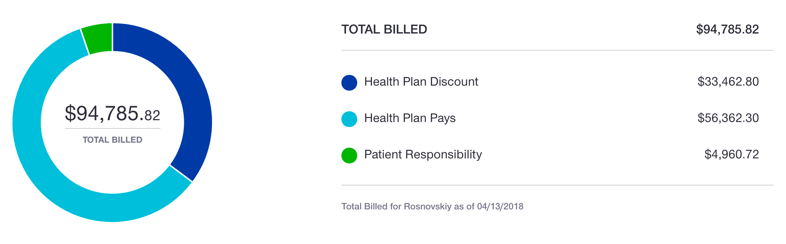

Поскольку вопрос про ногу задают мне часто и много, быстро отвечу всем сразу:

## Нога на месте!

В понедельник Ленка возила меня к  доктору-ногопатологу. Доктор оказался новый, но пожилой и в то же время какой-то левый. Сказал, что все у меня отлично, велел ногу сгибать-разгибать для range of motion и начинать крутить педали на велотренажере c отключенным сопротивлением. Ну не совсем крутить, а раскачивать: полный круг правая нога у меня не сделает, она сгибается где-то в диапозоне от 10 до 90 градусов сейчас, а для полного круга надо чтобы она сгибалась существенно больше. Рукой разрешил пользоваться как если бы я ее не ломал, она, типа, зажила совсем. Anyway, доктор какой-то левый, всё осмотрел, потыкал такой, и говорит: приходи через 5 недель, снова посмотрим. Ну тут я прифигел. Говорю, шэф, мы так не договаривались. Мой, говорю, доктор Уоррен обещал что еще через две недели я смогу на ногу начать наступать по-немногу. А этот мне, мол, ничего не знаю, от 8 до 12 недель наступать нельзя (и прошло, на минуточку, 6 недель). А потом он такой что-то где-то там в компьютере потыкал, и говорит: “хрен с тобой, золотая рыбка, приходи к своему доктору Уоррену через две недели и сам с ним разбирайся.” Ну и в общем вот. Совсем непонятно теперь, то ли еще 5 недель ждать, то ли через две недели останется три нелели ждать, то ли через две недели можно будет начинать ходить. В остальном, пока никакого видимого прогресса. На следующей неделе попробую костыли (Alexmak подогнал!). По идее, ходить с ними должно быть намного удобнее чем с чёртовым волкером, и даже удобнее чем ездить в кресле. Наконец, страховая обработала практически все выставленные счета. Примерный, но еще не окончательный расклад выглядит так: Общая сумма обработанных счетов: $94,785.82 Общая сумма скидок: $33,462.80 Оплачено страховой: $56,362.30

*Мне предстоит заплатить: $4,960.72*

Такие дела. А вообще, чтобы не сложилось неправильного впечатления, я веду не очень активную, но вполне полноценную жизнь: хожу в кино и рестораны, встречаюсь с друзьями, гуляю с семьёй в парке — редко, но всё же. Все нормально, и дальше будет только лучше. Я надеюсь. 