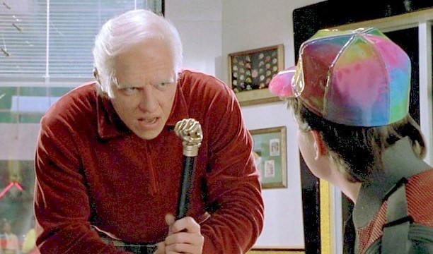
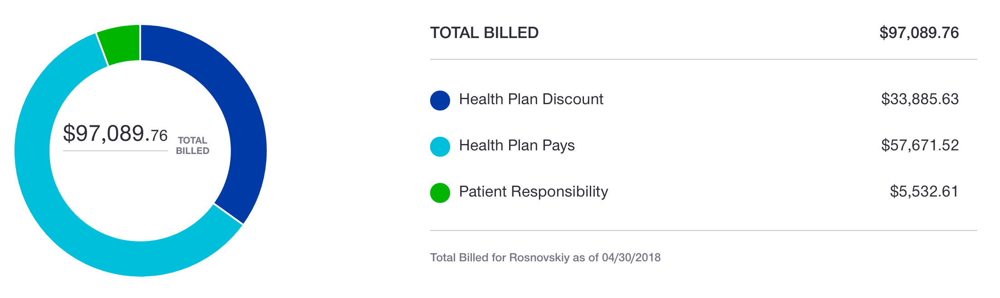

Привет вам из послеоперационной недели номер 10! Даже не верится, что я пережил уже 10 одноногих недель!

Собственно, события стали развиваться более стремительно, как только я встал на костыли и сел за руль 2 недели назад, и особенно когда я вышел на работу на прошлой неделе. Я перестал беречь ногу как будто она хрустальная, и стал ее беречь как будто она айфон Х: использую насколько могу, но стараюсь не ронять и ни обо что не бить лишний раз :)

Нога сгибается уже где-то на 120˚ (но все еще не разгибается полностью — сгибать, оказвается, легче чем разгибать!), но самое крутое, что можно крутить педали! 🎉 Ну а раз можно, то я, конечно, кручу. Пока на домашнем велотренажере, но в ближайшие недели, если все будет нормально, сяду и на нормальный велосипед.

На ногу можно ставить уже половину веса тела. Это сложно, потому что если 25% удобно отмерять (как только в ступне начниаются pins and needles, значит достиг 25%), то 50% отмерять не понятно как. Когда ставишь на ногу половину веса, вся ступня с непривычки болит, лодыжка болит и требует адвоката, икру практически сводит, а колену и тому месту, которое было сломано — хоть бы хны. Поскольку боль в мышцах начинается где-то на 30% и, насколько я понимаю, продолжается до самых 100%, как почувтствовать что у тебя именно 50% сейчас нагрузка, а не 75 и не 40, совершенно не понятно. Но это, возможно, на самом деле не супер важно, щас объясню.

Однажды, я выходил из дома на работу. На костылях закрывать дверь, открытую внутрь, неудобно: приходиться пятиться задом, потом дотягиваться до дверной ручки, тянуть ее на себя, пока дверь не упрется в костыль, потом снова пятишься назад, и так обычно два-три раза, пока дверь не закрыта полностью (сейчас я забил, и выхожу через гараж, где автоматические ворота). Ну в общем, однажды закрывал я так дверь, и под конец, когда собирался последний раз пятиться назад, потерял равновесие и стал падать на спину. Разумеется, есть рефлексы, которые никак нельзя пересилить, что ни делай, и когда ты стоишь на левой ноге и падаешь назад, организм непроизвольно, против твоей воли, выставляет назад правую ногу. Мой организм не исключение, и едва потеряв баланс, он тут же подставил правую, сломанную ногу для равновесия. Я в это же время в ужасе переносил правый костыль назад, чтобы встать на него, а на не на ногу, но не совсем успел. Весь акробатический трюк длился где-то секунды две (от потери ровновесия до выставления назад сломанной ноги до восстановления равновесия с помошью костыля), из которых примерно секунду я почти стоял с полным весом на правую ногу. Почти — потому что нога настолько ослабла, что мой вес она не в состянии поддержать, и как только я на нее встал, она начала подкашиваться — сгибаться в колене, несмотря на то, что я стоял на ней изо всех сил. В этот-то момент, к счастью, подоспел костыль, и ситуация была спасена. Никаких необычных ощущений нигде в ноге не было, ничего такого. Из чего я сделал вывод, что, в принципе, даже если сейчас дать на ногу случайно полный вес, она, скорее всего, не сломается. Поэтому я теперь немного спокойнее отношусь к тому, 40% я даю нагрузку или 60. Один фиг, всё уже достаточно надежно держиться, чтобы разница не влияла на процесс восстановления. При этом, разумеется, специально превышать разрешенный вес я не стану.

Собственно, в этот уикенд можно будет поднять нагрузку до 75%, а где 75 там уже и 100 не за горами. Таким образом, где-то в районе 11-13 мая я намерен начать ходить на своих двоих. Насколько я сейчас понимаю, первое время все равно мне нужна будет серьезная поддержка (как минимум трость, но скорее всего один костыль) — мышц в ноге осталось мало и они слабые, ходить на ней пока нельзя при всем желании.

Если вы сечёте в тростях, дайте знать, какие модели нынче в моде, чтобы трость была крутая, надежная и удобная. Эту модель не предлагать, говорят, легко ломается, когда выходишь из машины.

### Итого

Счета от врачей приходить перестали, и я не ожидаю больше никаких серьезный обновлений. Так что этот расклад можно считать условно-окончательным. Итого мне предстоит заплатить $5,533, страховая заплатила за этот перелом врачам и клиникам $57,671, а просили они $97,090. Такая вот загадочная, бессмысленная и беспощадная американская страховая медицинская система.