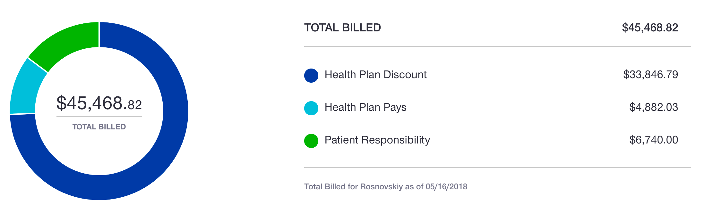

Прорыв! Вчера я пошел на своих двоих. Какой же это невероятный кайф, когда можешь взять кружку с кофе из кофеварки и донести её сам до стола!.. Такие, казалось бы, мелочи, а какая огромная разница: когда у тебя на протяжении почти трёх месяцев заняты руки (волкером или костылями), и вот наконец ты можешь ходить без специальных приспособлений, и твои руки свободны для вещей и предметов — это, товарищи, совершенно новый уровень свободы!

Собственно, вчера на физической терапии, которой я занимаюсь 2-3 раза в неделю в специальном зале со специально обученными специалистами, ногу как обычно мяли, терли и гнули во все стороны. Все как обычно, кроме того, что это был день, когда мне официально можно стоять на одной сломанной ноге. Как следствие, я теперь могу на ней ходить: мало кто задумывается, но когда мы ходим, мы постоянно переносим полный вес с одной ноги на другую; по сути, мы быстро стоим на сначала на одной ноге, потом на другой, и я теперь тоже так могу! Ну, то есть могу — в смысле, мне разрешено :) А вот могу ли я в действительности ходить, этот вопрос все ещё открыт. Ходить очень трудно, оказывается. И первые шаги свои я дела как обычно делают в кино персонажи, которых подстрелили в ногу :)) Но я довольно быстро разошелся, и после занятий щеголял по квартире на двух ногах, почти как нормальных пусть и жутко хромой человек.

Собственно, процесс реабилитации на этом не только не заканчивается, а можно сказать только начинается. Но такими темпами как сейчас, думаю, через месяц я буду в основном ходить как нормальный человек.

Разумеется, на радостях что я теперь двуногий, я вчера перестарался и сегодня всё болит так что ух. Поэтому дальше я буду, пожалуй, следовать совету, который дают все: не упариваться, pace yourself, take your time, nice and easy. На работу на костылях (тут много ходить приходится от парковки до стола, и по зданию, например, в туалет), а дома — на двух ногах: расстояния меньше, везде есть за что схватиться если что, ну и вообще, дома как-то спокойно. Схожу еще сегодня за почтой, по лестнице вниз, метров 100 до ящика и обратно.

В общем, нормальность всё ближе и ближе, и я уже не могу дождаться, когда я смогу не задумываясь лишний раз просто съездить в магазин, сходить погулять, или отвезти кошек к ветеринару, например.

### Деньги

>    — С вас сто тысяч долларов.
>
>    — Что?
>
>    — Что?

Собственно, упоролся не только я вчера на ходьбе, но и страховая. Что-то они там где-то пересчитали, передвинули, повернули, и теперь картинка выглядит вот так: 

Почему? Что случилось? Что изменилось? Ничего не понятно, но теперь почему-то сумма счетов вдвое меньше, чем была, а моя доля к оплате на $1,500 больше чем была. У этого, впрочем, есть и silver lining: мой maximum out-of-pocket лимит — $6600, и посольку я его теперь достиг, все, абсолютно все покрытые строховкой медицинские услуги для меня теперь на 100% бесплатные до конца года. Планирую записаться на массаж, починить нос, на этом фантазия кончилась :)

Ладно, я _побежал_. На связи!