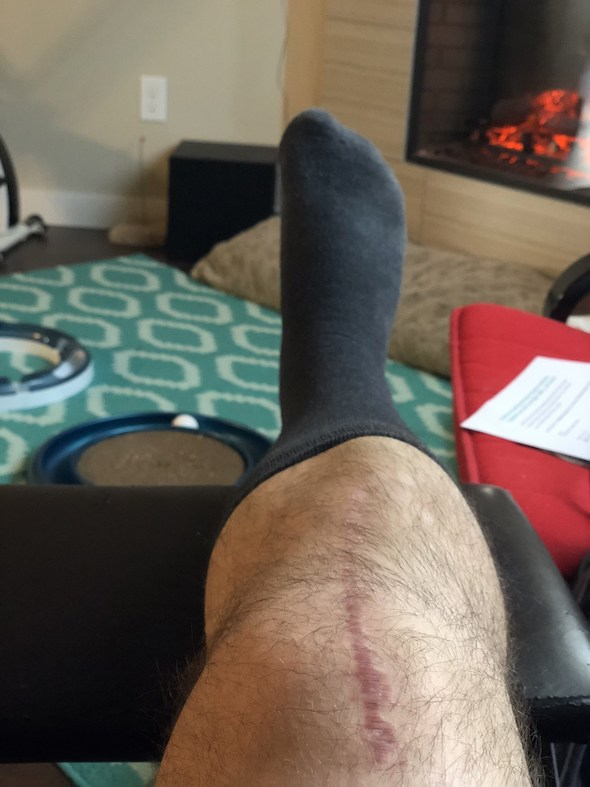

Серия про ногу постепенно подходит к концу. Думаю, еще пару записей наберется, а дальше уже жизнь войдет обратно в нормальное русло (до тех пор, конечно, пока я еще что-нибудь себе не сломаю, хаха).

Итак, что мы имеем? Мы имеем 3.5 месяца после перелома и операции. Нога сгибается-разгибается в диапозоне от 3˚ до 128° (весьма недурно). Вчера я окончательно отказался от трости — не только потому что она оказалась довольно дурацкой, но и потому что с ней я какой-то перекошенный. Без нее я, разумеется, тоже перекошенный, но как-то более естественно что ли :)

Я очень сильно хромаю, хожу очень медленно, и довольно быстро устаю, но это грандиозный прогресс даже по сравнению с прошлой неделей. Отёк колена практически полностью сошел, мышцы постепенно нарастают обратно. Шрам затянулся отлично, и внизу его почти совершенно не видно, а вот на колене, в той части, которая все время сгибается и разгибается, пока все-таки очень заметно. Мне кажется, что верхняя часть титановой пластинки выступает немного справа вверху. Вообще, я все эти железки не чувствую совершенно, но в то же время я иногда ощущаю их присутствие. Это сложно описать словами: это такое очень легкое ощущение чего-то инородного, когда определенным образом сгибаешь ногу или поворачиваешь ее. Не больно, ничего такого, но как бы сразу так “о, точно, титановая пластина”. Наверное, пройдет со временем.

Физиотерапия идет своим чередом, на этой неделе занятий не было, на слудующей только один раз. Короче, мы здесь власть и надо брать тренировки в свои руки (ноги, то есть). Ну я и взял. Помимо всяких небольших упражнений, которые я делаю в течение дня, я теперь катаюсь на велосипеде. Да-да, на том самом велосипеде из [первой части](/blog/2018/02/27/the-leg-chronicles-part-1/). Сегодня вот съездил до работы и обратно.

Это, конечно, победа, как ни крути. Наверное, еще 2-3 раза попрактикуюсь, а потом уже попробую в рабочий день прям в офис на велике съездить. На дорогу уходит примерно 35 минут, если не торопиться, и можно, наверное, уложиться минут в 30 если торопиться. Но торопиться мне пока чрезвычайно боязно, поэтом, well, езжу не торопясь.

Из планов на обозримое будущее, 18 июня у меня встреча с моим хирургом. Он посмотрит рентген, и если никаких смещений не видно, это будет наша последняя регулярная встреча.

У вас, кстати, может, есть какие-то вопросы обо всем этом ноголомательном безобразии — вы не стесняйтесь, спрашивайте.